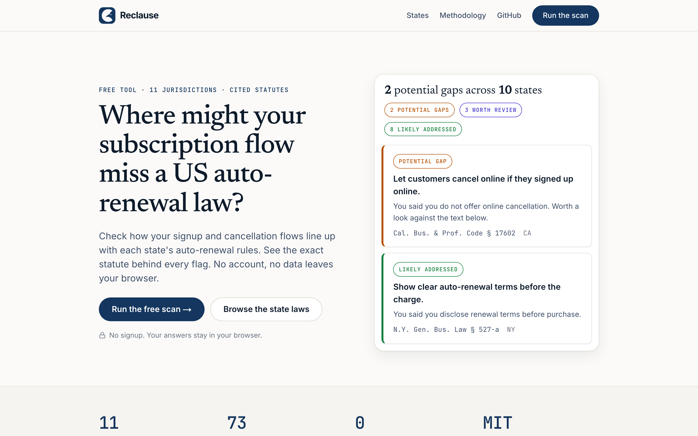
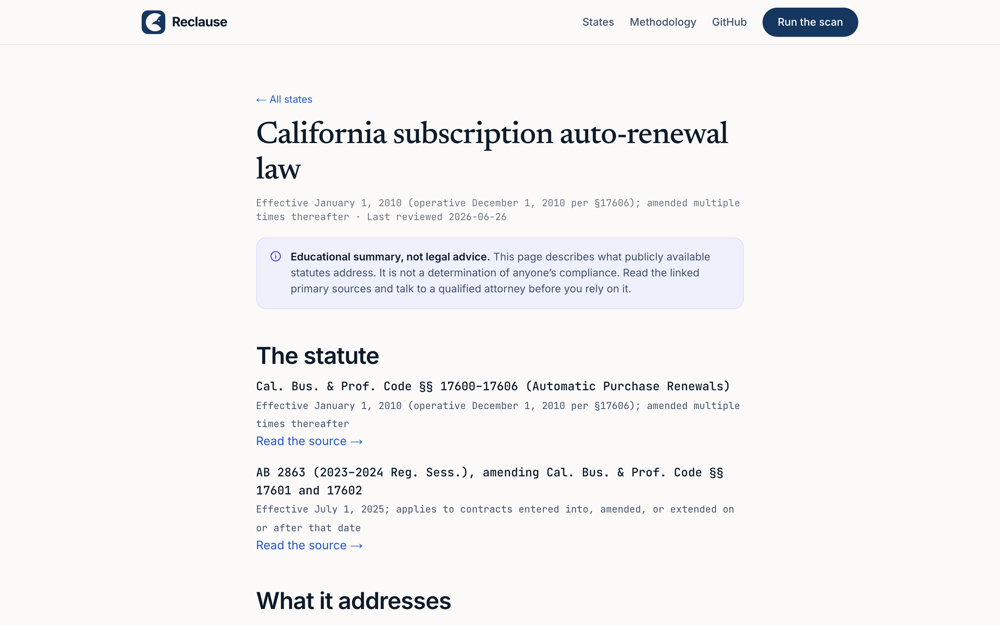
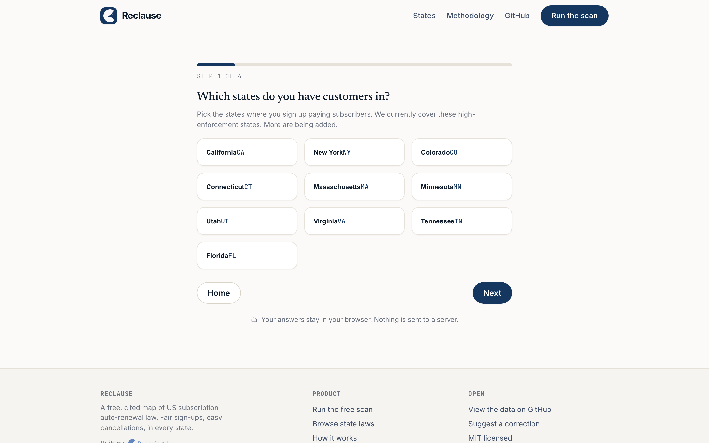

<p align="center">
  
</p>

<h1 align="center">Reclause</h1>

<p align="center"><strong>Fair subscriptions, clause by clause.</strong></p>

<p align="center">
  A free, educational tool that checks your subscription signup and cancellation flows against
  each US state's auto-renewal (negative-option) law — with the exact statute behind every flag.
</p>

<p align="center">
  
  
  
  
</p>

> **Not legal advice.** Reclause is an automated educational tool. It describes what publicly available state statutes address, based only on the answers you provide, and it never tells you that you are compliant or in violation. Consult a qualified attorney before relying on any of it.

A [Penguin Alley](https://penguinalley.com) project.

---

## Why it exists

US subscription auto-renewal law is a 30+ state patchwork, and enforcement is hot. Eight states added or amended auto-renewal / "negative-option" laws in 2025 (California AB 2863, New York, and more), the FTC's federal "click-to-cancel" rule was vacated in 2025 (so there is no federal floor), and recent negative-option settlements have reached into the billions. Most subscription businesses are exposed and unaware. The tools nearby either generate policy *language*, handle cancel-button *mechanics* for big companies, or are reactive law-firm alerts. None give a small operator a free, honest, per-state **gap diagnostic**. That's the gap Reclause fills.

## See it

Answer a few plain-English questions about how you sign customers up and how they cancel, pick the states you serve, and get a per-state list of where your flow may have gaps — each one linked to the statute itself.

<p align="center">
  
</p>

Every covered state has its own answer-first, cited page (the per-state law, in plain English):

<p align="center">
  
</p>

The scan is a short questionnaire. Nothing is uploaded; your answers stay in your browser:

<p align="center">
  
</p>

## How it's built (and why that matters)

Two principles: **be honest, and be deterministic.**

- **An open, cited dataset.** [`data/arl-states.json`](data/arl-states.json) maps each covered state's auto-renewal requirements — disclosure, consent, acknowledgment, cancellation, renewal and trial notices — onto seven fixed categories, every one tied to a statute citation and a primary-source URL. It is open so anyone can check our work. It is research-grade and dated; **verify against primary sources before relying on it.**
- **A deterministic engine — no AI deciding your compliance.** [`lib/scanner.ts`](lib/scanner.ts) matches your answers to the dataset with plain, inspectable rules. No language model is in the scoring path. Every result is one of three honest things: **potential gap** (you said you don't do something a statute addresses), **worth review** (you weren't sure), or **likely addressed** (you said you already do it — which is *not* the same as "verified compliant"). A runtime guard makes it structurally impossible for the output to assert compliance or violation, and the dataset loader fails the build if any entry contains advisory language.

## Coverage

11 jurisdictions: California, New York, Colorado, Connecticut, Massachusetts, Minnesota, Utah, Virginia, Tennessee, Florida, plus the federal (FTC / ROSCA) picture — 73 cited requirements in all. More states are added over time. (Two states whose first-pass research didn't pass our verification gate were intentionally held back rather than shipped wrong.)

## Run it

```bash
npm install
npm test         # 21 tests — the engine + liability invariants
npm run build    # static build (Next.js App Router)
npm run dev      # http://localhost:3000
```

## The optional paid service

The scan is free forever. If you find gaps you want fixed, Penguin Alley offers a **purely technical** fixed-scope engagement: we implement the signup, consent, and cancellation-flow changes *you or your attorney* specify — the engineering and UX work, not the legal opinion. We build to your spec; we don't give legal advice or decide your compliance. [Talk to us →](https://penguinalley.com/en/services?ref=reclause-readme#penny)

## Contributing to the dataset

Found a statute we got wrong, missing, or stale? That's the most valuable contribution. Open an issue with the state, the citation, and a primary-source link.

## License

Reclause is released under the [MIT License](LICENSE) — both the code and the `data/arl-states.json` dataset are free to use, modify, and redistribute (including commercially), with attribution. See [`DISCLAIMER.md`](DISCLAIMER.md) for the (important) legal disclaimer that governs all use of the tool and the data.
